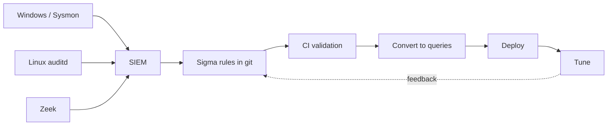

# Home SOC Detection Library

> A version-controlled library of Sigma detection rules for a home SOC lab, mapped to MITRE ATT&CK and built to catch attacker behaviour across endpoints, hosts, network and web.

**Status:** Active · **Updated:** 2026-10-08

## Overview

Detection-as-code treats detection logic the same way software teams treat
application code: every rule is a plain-text file in git, changed through pull
requests, reviewed by a second set of eyes, and validated automatically before
it ships to the SIEM. Writing detections as [Sigma](https://sigmahq.io/) rules
keeps them vendor-neutral - one rule converts to Splunk SPL, Elastic, Microsoft
Sentinel or others at deploy time.

Keeping rules in git buys the things ad-hoc SIEM saved searches never give you:

- **Review** - a rule is read and approved before it can alert, so logic errors
  and noisy conditions get caught early.
- **Versioning** - every tweak has an author, a date and a diff; a regression
  can be traced to the commit that caused it and rolled back.
- **Testing** - rules are checked against the Sigma schema and fired at known
  telemetry before they reach production.
- **CI** - validation and conversion run on every change, so a broken rule fails
  the pipeline instead of failing silently at 3am.

This repository is lab-scoped. All examples use RFC 5737 documentation addresses
(192.0.2.0/24) and example.com, and every detection is written to run against
authorised telemetry from my own isolated home lab.

## Detection Pipeline



## Repository Layout

```
detections/
|-- README.md              # this file
|-- CONTRIBUTING.md        # how to add and review a rule
|-- docs/
|   `-- testing.md         # validate and convert rules locally
`-- rules/
    |-- windows/           # Windows Security + Sysmon event detections
    |-- linux/             # auditd and syslog detections
    |-- network/           # Zeek / network telemetry detections
    |-- web/               # web server and proxy log detections
    `-- cloud/             # cloud audit log detections (placeholder)
```

## Rule Conventions

Every rule is a single Sigma YAML document and carries the following fields:

| Field           | Purpose                                                        |
| --------------- | ------------------------------------------------------------- |
| `title`         | Short, human-readable name                                     |
| `id`            | A stable UUIDv4 - never reused or edited once assigned         |
| `status`        | `experimental`, `test` or `stable`                             |
| `description`   | What it detects and the lab assumptions behind it              |
| `references`    | ATT&CK page plus vendor or field documentation                 |
| `author`        | Rule author                                                    |
| `date`          | ISO 8601 (`YYYY-MM-DD`) creation date                          |
| `tags`          | MITRE ATT&CK tactic and technique tags (`attack.t1059.001`)    |
| `logsource`     | `product`, `service` and/or `category` the rule reads          |
| `detection`     | Named selections plus a `condition` expression                 |
| `falsepositives`| Known benign triggers, as a list                               |
| `level`         | `informational`, `low`, `medium`, `high` or `critical`         |

Field names in `detection` come from the documented log schema only - Windows
and Sysmon event IDs, auditd record fields, Zeek log fields and web access log
fields. No field is invented.

## Testing

Rules are validated locally before they are committed, and again in CI:

- **Schema check** - `sigma check rules/` parses every rule and flags schema or
  field errors (install with `pipx install sigma-cli`).
- **Conversion** - `sigma convert -t splunk rules/` (or `-t elasticsearch`)
  turns a rule into a backend query, confirming it translates cleanly.
- **Telemetry test** - converted queries are run against captured lab logs to
  confirm the rule fires on the real event and stays quiet otherwise.
- **Safe test generation** - [Atomic Red Team](https://github.com/redcanaryco/atomic-red-team)
  executes the mapped ATT&CK technique in the isolated lab so the detection can
  be proven end to end before deployment.

Full steps are in [docs/testing.md](./docs/testing.md).

The Windows rules assume the audit policy, Sysmon configuration and forwarding described in
[docs/windows-ad-logging-baseline-for-detection.md](./docs/windows-ad-logging-baseline-for-detection.md),
which also maps each attack technique to the events it produces.

## ATT&CK Coverage

| Rule                               | Technique   | Name                                    |
| ---------------------------------- | ----------- | --------------------------------------- |
| windows/new_service_install_7045   | T1543.003   | Create or Modify System Process: Service|
| windows/wmi_process_creation       | T1047       | Windows Management Instrumentation      |
| windows/lsass_access_sysmon10      | T1003.001   | OS Credential Dumping: LSASS Memory     |
| windows/scheduled_task_creation_4698 | T1053.005 | Scheduled Task                          |
| windows/encoded_powershell_4104    | T1059.001   | Command and Scripting: PowerShell       |
| windows/rdp_bruteforce_4625        | T1110       | Brute Force                             |
| linux/auditd_suspicious_cron       | T1053.003   | Scheduled Task/Job: Cron                |
| linux/linux_reverse_shell_bash     | T1059.004   | Command and Scripting: Unix Shell       |
| linux/ssh_bruteforce_authlog       | T1110       | Brute Force                             |
| network/zeek_dns_long_txt_exfil    | T1048 / T1071.004 | Exfiltration / DNS C2             |
| web/nikto_user_agent               | T1595       | Active Scanning                         |
| web/sqli_error_pattern             | T1190       | Exploit Public-Facing Application       |

---

**Author:** Danny Stanfield · Perth, WA

**License:** MIT
